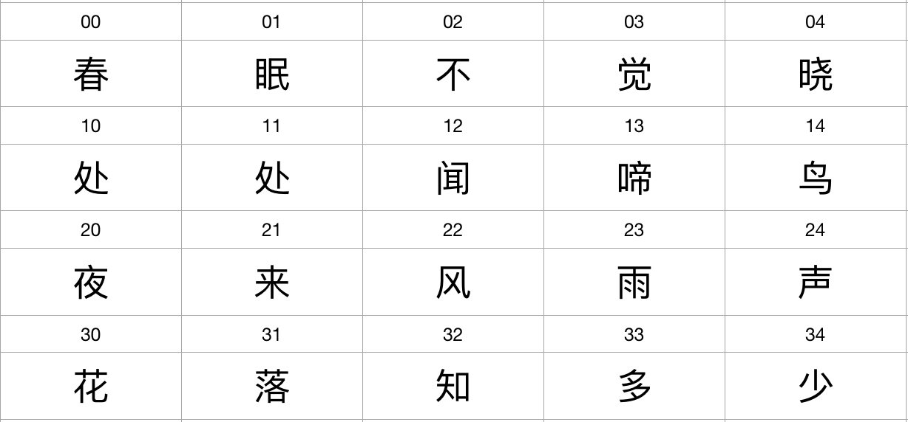
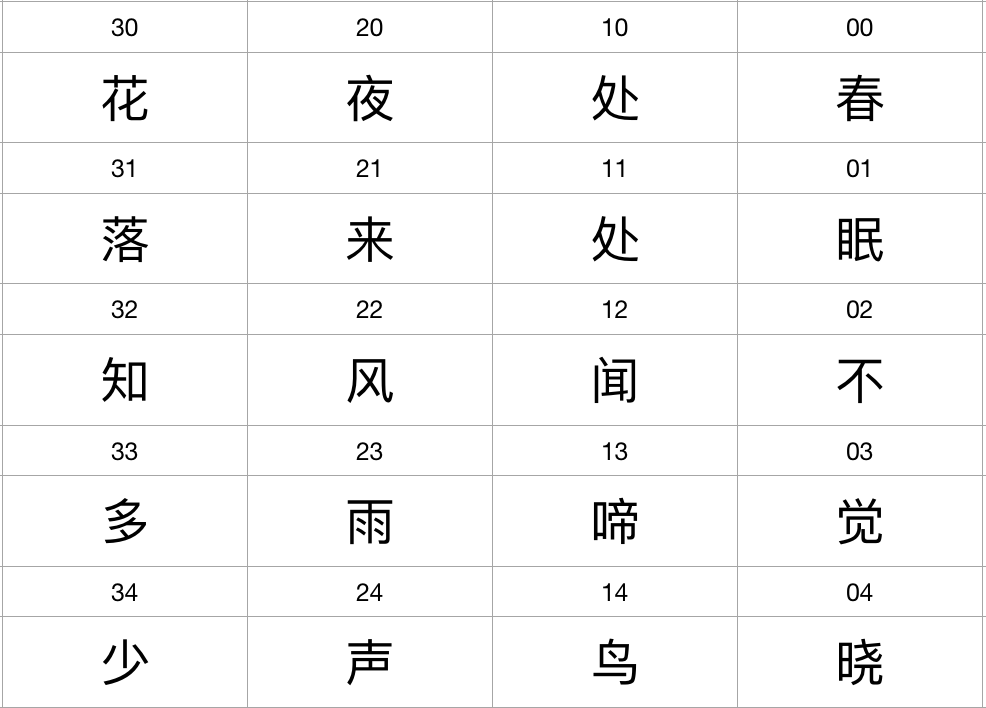

# 数组练习

## 1、翻转数组

设存在以下数组:

```java
char[][] chunxiao = {
        {'春', '眠', '不', '觉', '晓'},
        {'处', '处', '闻', '啼', '鸟'},
        {'夜', '来', '风', '雨', '声'},
        {'花', '落', '知', '多', '少'}
};
```

使用以下代码遍历数组:

```java
for (int i = 0; i < chunxiao.length; i++) {
    for (int j = 0; j < array.length; j++) {
        System.out.print(chunxiao[i][j] + "\t");
    }
    System.out.println();
}
```

其输出"顺序"如下图所示:



尝试设计一组循环语句，将以上形式的输出结果翻转为以下形式:



## 2、数组排序

设存在以下数组:

```java
// 设 names 数组中存放学生姓名
String[] names = {"雷军", "马云", "谭浩强", "佟瑶", "蓝馨怡"};
// 设 courses 数组中依次存放三门课程的名称
String[] courses = {"C++", "Java", "English"};
// 设 scores 数组中依次存储的是 names 数组中各个学生的 C++ 、Java 、English 课程的成绩
String[] courses = {"C++", "Java", "English"};
int[][] scores = {
        {90, 89, 75}, 
        {59, 40, 100}, 
        {100, 99, 80}, 
        {80, 61, 61}, 
        {60, 100, 99}
};
```

采用以下程序可以输出每个学生的姓名以及该学生各门课程的成绩:

```java
for (int i = 0; i < scores.length; i++) {
    // 输出学生姓名
    System.out.print(names[i] + " => ");
    for (int j = 0; j < scores[i].length; j++) {
        // 输出课程名称
        System.out.print(courses[j] + ": ");
        // 输出课程成绩
        System.out.print(scores[i][j]);
        if (j < scores[i].length - 1) {
            System.out.print(", ");
        }
    }
    System.out.println();
}
```

使用以下程序可以按照各个学生的英语成绩进行排序(降序):

```java
for (int i = 0; i < scores.length - 1; i++) {
    for (int j = 0; j < scores.length - 1 - i; j++) {
        int f = scores[j][2];
        int s = scores[j + 1][2];
        if (f < s) {
            int[] temp = scores[j];
            scores[j] = scores[j + 1];
            scores[j + 1] = temp;
            
            String x = names[j];
            names[j] = names[j + 1];
            names[j + 1] = x;
        }
    }
}
```

尝试设计程序，根据各门课程的总分进行排序(降序排列),

并输出学生姓名、每门课程的名称和该学生的成绩、该学生的总成绩

## 3、数组比较

两个"相等"数组，必须保证两个两个数组满足以下条件:

- 数组长度相等
- 两个数组中相应位置的元素全部相等

在 ArrayHelper 类中增加一组相互重载的 equal 方法，实现判断数组是否相等。

比如判断 int 类型数组是否相等，可以使用:

```java
public static boolean equal(int[] first, int[] second) {
}
```

完成以上 equal 方法后，在 main 方法中予以测试:

```java
public static void main(String[] args) {
    int[] first = {1, 3, 5, 7, 9};
    int[] second = {1, 3, 5, 9, 7};
    int[] third = {1, 3, 5, 7, 9};
    int[] fourth = {1, 3, 5, 7};
    
    boolean x = equal(first, second);
    System.out.println(x); // false
    
    x = equal(first, third);
    System.out.println(x); // true
    
    x = equal(first, fourth);
    System.out.println(x); // false
}
```

## 4、输出六十甲子

声明三个数组，分别表示 `中国纪年法` 中的 `天干` 、`地支` ，以及 `生肖` :

```java
public static void main(String[] args) {
    char[] heavenlyStems = {'甲', '乙', '丙', '丁', '戊', '己', '庚', '辛', '壬', '癸'};
    char[] earthlyBranches = {'子', '丑', '寅', '卯', '辰', '巳', '午', '未', '申', '酉', '戌', '亥'};
    
    // 输出六十甲子名称(要求每行输出12个，总共输出 5 行)
}
```

在中国古代的纪年法中，采用`天干`和`地支`相组合的方式来表示一个年份，其组合规则为:

```
甲子、乙丑、丙寅、丁卯、戊辰、......、壬申、癸酉、甲戌、乙亥、丙子、丁丑、戊寅、...... 、壬戌、癸亥
```


其中 `甲子` 是第一个组合，也是一个甲子六十年的开始。

十天干与十二地支按顺序两两相配，从**甲子**到**癸亥**，共六十个组合，称六十甲子。(
60年一个循环 )
